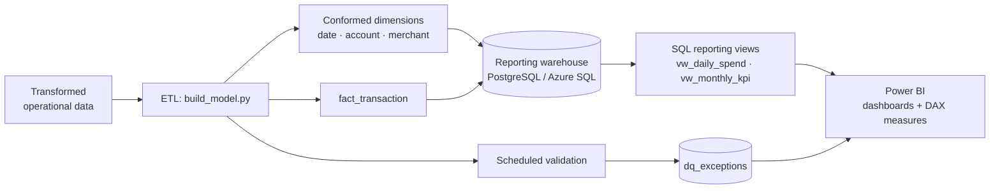

# Power BI Reporting & Data-Modelling Framework

A reporting framework and dimensional data model that feeds automated Power BI
dashboards over transformed data — and keeps them trustworthy by surfacing
data-quality exceptions through scheduled validation.

The Python ETL turns a flat operational feed into a Kimball-style **star
schema** (conformed date/account/merchant dimensions around a transaction
fact), exposes reusable **SQL reporting views**, ships the **DAX measures** and
model wiring Power BI needs for time-intelligence, and runs a **nightly
validation** job that writes exceptions to a table the dashboard charts
alongside the numbers they affect.

[](https://github.com/OWNER/powerbi-reporting-framework/actions/workflows/ci.yml)

## Architecture



## Stack

Python · pandas · SQLAlchemy · SQL (PostgreSQL / Azure SQL) · Power BI (DAX,
star schema) · GitHub Actions · PyTest. Runs on a local SQLite model out of the
box — no database or Power BI licence needed to see it work end to end.

## Quickstart

```bash
python -m venv .venv && source .venv/bin/activate
pip install -r requirements.txt

# Build the star schema and run scheduled validation in one step
python -m etl.run --rows 250000

# Run the tests (model + validation)
pytest -q
```

Example output:

```
Model built:
  dim_date: 366
  dim_account: 5,000
  dim_merchant: 8
  fact_transaction: 250,000
  stg_transactions: 250,000

Validation:
{
  "total_fact_rows": 250000,
  "total_exceptions": 4980,
  "exception_rate": 0.0199,
  "by_rule": { "orphan_merchant": ..., "missing_or_out_of_range_date": ..., "negative_non_refund": ... },
  "passed": false
}
```

## How it works

**ETL / model build** (`etl/build_model.py`) reshapes the flat feed into a
star schema. It generates a full `dim_date` so Power BI gets proper
time-intelligence, assigns surrogate keys to the account and merchant
dimensions, and negates refunds into a `signed_amount` fact measure.

**Reporting views** (`sql/analytics_views.sql`) hold business logic —
daily spend, monthly KPIs, exception rollups — in SQL so it's reusable across
Power BI, ad-hoc queries and tests rather than trapped inside one `.pbix`.

**Power BI layer** (`powerbi/`) documents the [data model and
relationships](powerbi/data_model.md) and provides the [DAX
measures](powerbi/measures.dax): `Net Revenue`, `Net Revenue YTD`,
`Net Revenue MoM %`, `Refund Rate`, `Data Quality Score`, and more.

**Scheduled validation** (`validation/rules.py`) runs after every rebuild.
Each rule returns offending rows tagged with a name and severity; all
exceptions land in `dq_exceptions`, which the dashboard's Data Quality page
reads via `vw_dq_exceptions`. This is what makes "timely, accurate reporting"
defensible — the numbers and the exceptions that qualify them live together.

## Validation rules

| Rule | Severity | Catches |
|---|---|---|
| `orphan_merchant` | error | fact rows whose merchant key has no dimension |
| `orphan_account` | error | fact rows whose account key has no dimension |
| `missing_or_out_of_range_date` | error | dates absent from `dim_date` |
| `negative_non_refund` | warning | negative amounts not flagged as refunds |

## Connecting Power BI

See [`powerbi/data_model.md`](powerbi/data_model.md) for the full walkthrough:
point Power BI at the warehouse, confirm the star-schema relationships, mark
`dim_date` as the date table, paste in the measures, and schedule refresh to
run after the nightly `etl.run`.

## Project layout

```
etl/           source generation, star-schema builder, nightly run job
sql/           star-schema DDL + reporting views
powerbi/       DAX measures + data-model documentation
validation/    scheduled data-quality rules
tests/         PyTest suite (model + validation)
.github/       GitHub Actions CI
```

## Configuration

| Variable | Default | Purpose |
|---|---|---|
| `BI_WAREHOUSE_DSN` | local SQLite | SQLAlchemy DSN for the reporting warehouse |
| `BI_ROWS` | `250000` | default rows to generate |
| `BI_SEED` | `7` | RNG seed for reproducible data |

## License

MIT
