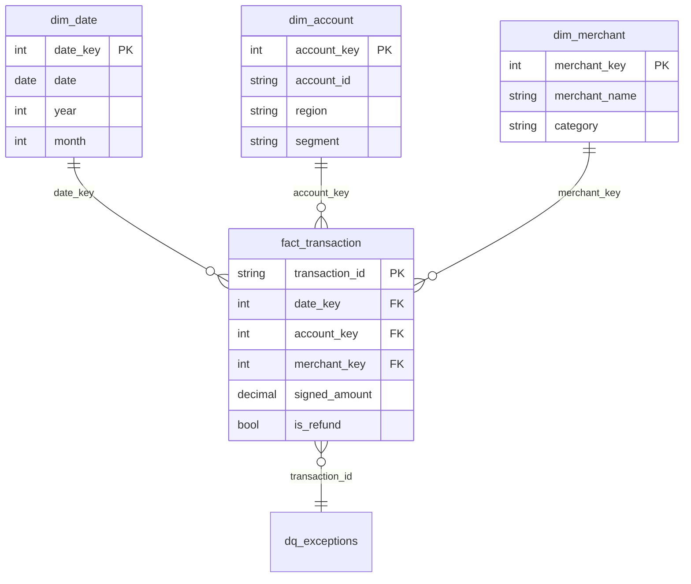

# Power BI Data Model

The `.pbix` connects to the warehouse (`vw_*` views plus the dimension and
fact tables) via **Import** or **DirectQuery**. Rebuild the model with
`python -m etl.run`, point Power BI at the warehouse, and load these tables.

## Relationships (star schema)

All relationships are single-direction (dimension → fact), one-to-many.
`dim_date` is marked as the model's **date table** so time-intelligence
measures (`Net Revenue YTD`, `Net Revenue MoM %`, `SAMEPERIODLASTYEAR`)
work out of the box.

## Setup steps

1. Build the model: `python -m etl.run` (or point `BI_WAREHOUSE_DSN` at
   Postgres/Azure SQL and run against that).
2. In Power BI Desktop: **Get Data → SQL Server / SQLite / ODBC**, select the
   dimension + fact tables and the `vw_*` views.
3. **Model view**: confirm the relationships above (Power BI usually
   auto-detects them from the keys).
4. **Mark as date table**: select `dim_date`, set `date` as the date column.
5. Paste the measures from [`measures.dax`](measures.dax) into a `Measures`
   table.
6. Configure **Scheduled refresh** in the Power BI Service to run after the
   nightly `etl.run` job.

## Suggested report pages

* **Executive summary** — `Net Revenue`, `Net Revenue YTD`, `Net Revenue MoM %`,
  `Average Ticket`, trend by month from `vw_monthly_kpi`.
* **Spend explorer** — `vw_daily_spend` sliced by region and category.
* **Data quality** — `Data Quality Score`, `Exception Count` by rule from
  `vw_dq_exceptions`, so exceptions surfaced by scheduled validation are
  visible next to the numbers they affect.
